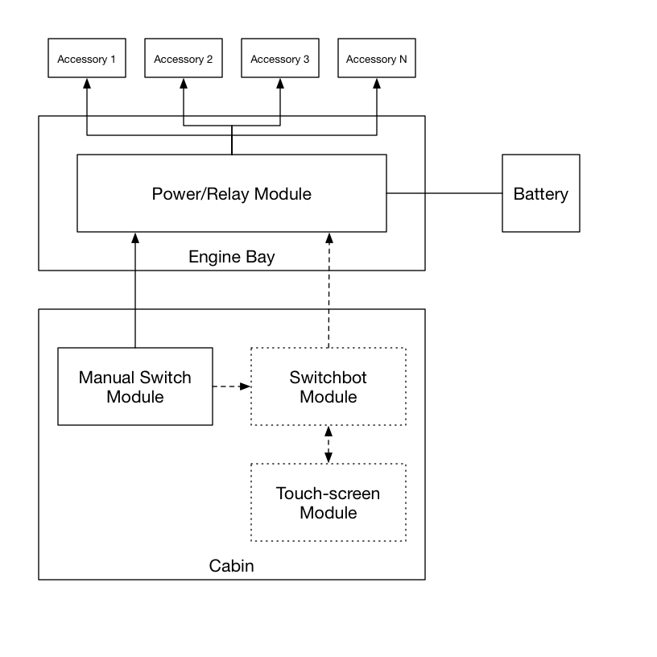

# Switchbot - The Smart Automotive Switching System (SASS)

## Overview

The "Switchbot" project is a smart switching system for automotive accessories. Imagine
having your off-road lights automatically controlled by your high-beams, or your aftermarket
LED headlights directly powered without special wiring harnesses, elimating both flicker and
swiching delays. Imagine having additional interior lighting or accessories automatically
activated whenever the car is switched on, or when the night-time interior lights are activated
by the vehicle. Imagine doing all of this without splicing any of the existing wiring. Switchbot
will do all of this, and more.

### Why is This Even Needed?

Utility vehicles frequently have many accessories installed by the owner or by vendors. These
accessories include additional lighting, recovery equipment (i.e. winches), sirens, 
radio/communication equipment, etc. Frequently, these accessories are installed by splicing
into the vehicle's own electrical wiring, which ultimately can cause system failure as 
connections fail and corrode over time. In an off-road environment, this situation is accelerated
by the harsh conditions.

In addition, vehicles today have complex electrical systems. Much of the vehicle's systems
communicate to one another using networking technologies such as a CAN bus or a LIN bus. These
networking systems cannot be used directly without adversing affecting the vehicle's operation.

Some vehicle manufacturers provide "upfitter" modules that are designed specifically for the
purpose of controlling aftermarket accessories. However, these seem to be currently limited 
only to truck vehicles, and not for off-road sport vehicles.

The marketplace has answered by providing accessory controllers that isolate the vehicle's
electrical system from accessories. Unfortunately, these modules completely isolate themselves
from the vehicle's electrical system, providing no integration features, such as automatic
light control.

The "switchbot" project aims to fill this hole in the marketplace with an intelligent and
integrated accessory control system. Initially this system will be aimed for the Jeep
Wrangler using the JK/JKU platform.

## Design

The production design of "Switchbot" will separate the system into the following primary modules:

1. A power/relay module - located in the engine bay, this module directly powers your accessories
using standard automotive relays and is the central wiring hub. Directly connected to the 
vehicle battery, it isolates all accessories from the vehicle's own electrical system.
2. A manual switch module - an optional module that provides physical switches for master overrides
for each accessory.
3. The Switchbot module - an optional module that integrates with the vehicle's electrical system
and operates accessories based on vehicle activity and user configuration.
4. Touch-screen - an optional module that provides a touch-screen interface for switches instead
of manual switches.

This design approach fulfills the following requirements for both hobbist and commerical
productization:

1. Lower price points by separating advanced features from the basics.
2. Lower price points by allowing different numbers of accessory connections in the power/relay
module. For example, the lower price module may only contain 4 switches, whereas the deluxe
module may include 8 or more.
3. Isolating vehicle-specific interfacing and software into a single module, separate from
the power/delay module, allowing easy multi-vehicle support in the future.
4. The unintelligent power/relay module can be used to provide users with their own basic
switching platform, with additional reliability and flexibility compared to the typical homegrown
solution.

### Power/Relay Module Design Considerations

The power/relay module is the hub that all aftermarket accessories will connect to. This 
module will provide each accessory connectin with an individualy fused power and ground
connection. Power to each accessory will be controlled by an external switching module.
The power/relay module will be directly connected to the battery, via a master breaker,
completely isolating accessories from the rest of the vehicle's electrical system.

The power/relay module is the simplest of all the modules in the smartbot system, but has
the most expensive components and the highest environmental demands due to its location
in the engine compartment. 

Automotive-class relays tend to be relatively expensive, ranging from $1.50 to $7.50 each.
Solid-state relays are not yet an option, as they are both too expensive and general, and
provide very limited options for high current (25a, 30a, or 40a load) applications.

While not required in the initial release of the module, the power/relay board will
include additional features such as a low-voltage cutoff circuit to prevent the vehicle's
battery from being drained.

### Switchbot Module Design Considerations

The switchbot module is ultimately a micro-controller that interfaces with the power/relay
module and with the vehicle's own communication network. On the JK platform, this means
the module should communicate to the CAN interior bus, and potentially the powertrain CAN
bus, so that it can detect when certain vehicle systems are activated, e.g. the headlamps.

Many modern micro-controllers targetted at the automotive market include CAN and/or LIN
interfaces, such as the Microchip PIC18 or the Texas Instruments C2000 families. As of
this writing, however, these MCUs are typically not cheaper than a multi-chip system
built around an MCU and a combination of a CAN controller and transceiver. Additionally,
all of the prototyping and research work has been done using ATMEGA MCUs, using the
Arduino platform, and Microchip's MCP2515 and MCP2551 CAN ICs. In the initial versions
of the smartbot system, the ATMEGA 328, the MCP2515, and the MCP2551 will be used
to lower the overall risk of the project. Future versions of find cost savings,
enhanced reliability, and increased CPU power by moving to an all-in-one MCU solution.

The JK platform has three CAN busses: the diagnostic CAN bus, the powertrain CAN bus,
and the interior CAN bus. All three busses terminate in the vehicle's TIPM module,
located in the engine compartment. While desierable, it is not practical to interface
with the busses via this module as the wiring terminals are water-resistent and 
complex.

There are two likely approaches for intefacing with the vehicle from the cabin: using
the diagnostic bus or the CAN interior bus. At first glance, the diagnostic bus would
appear ideal, but is not designed for long-running embedded applications. Additionally,
reverse engineering the necessary information available over the bus is highly time
consuming. Purchasing the same information directly from the manufacturer is out of
the range of a hobbist project, nor would it enable the project to be open-sourced.

Left with the CAN interior bus, we find that all of the information we are after is
directly available. The JK's EMIC module communicates all user activated features
to the TIPM. If the user or ambient light sensor wants the headlights on, the EMIC
makes it happen by telling the TIPM over the CAN interior bus. Switchbot can spy on
these messages and activate its own switches as needed.

The switchbot module must communicate to the power/relay module to activate each
individual accessory as needed. Two alternatives have been considered for this
communication:

1. Using a private communication channel, such as another CAN bus, between an MCU
on the power/relay module and an MCU on the switchbot module.
2. Individual switch signals to drive the relays in the power/relay module.

For the initial version, individual switch signals will be used to simplify the overall
system design and to keep costs down. Each switch signal is driven by an opticoupler 
which is in turned driven by the MCU (via a shift register IC). This will isolate the
MCU's 5v system from the 12v system needed to drive the automotive grade relays.

